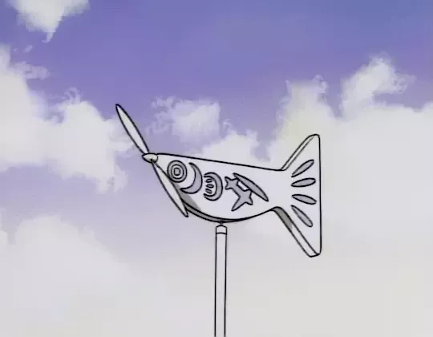

# Yokohama-trip

**Yokohama-trip** es un proyecto _educativo_ que consiste en elaborar una pagina web sencilla (_Landing page_) con la posibilidad de personalizarla con los intereses particulares de los estudiantes. Esta actividad forma parte del pensum de [The Odin Project](https://www.theodinproject.com/lessons/foundations-landing-page).

Para desarrollar **Yokohama-trip**, intente simular una entrada de blog difundiendo la obra [Yokohama Kaidashi Kikou](https://www.anime-planet.com/manga/yokohama-kaidashi-kikou) de [Hitoshi Ashinano](https://es.wikipedia.org/wiki/Hitoshi_Ashinano).

Utilizo contenido protegido bajo _copyright_ respaldándome en **uso legitimo**, ya que es una actividad **académica**, **sin fines de lucro** y **que no pretende perjudicar a los involucrados en la obra antes mencionada**.

